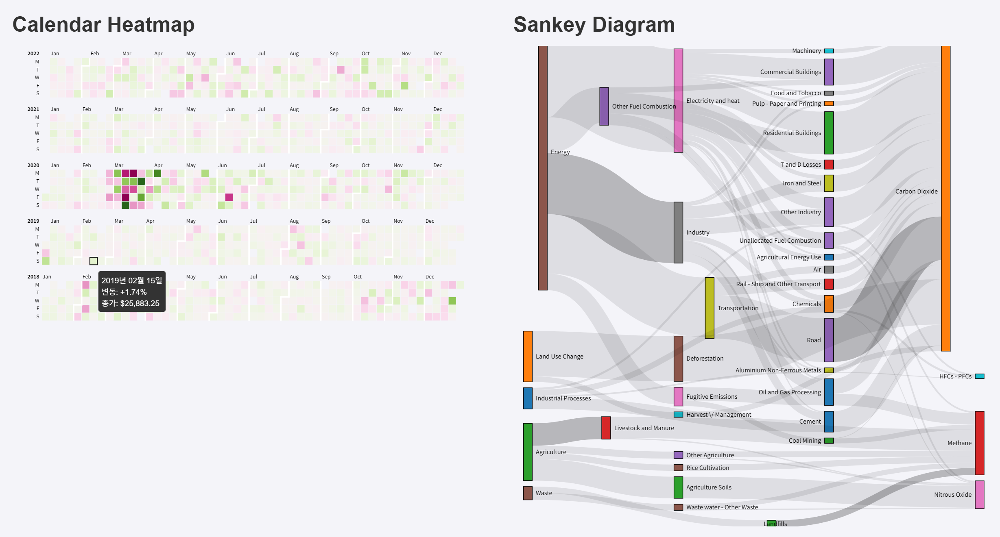

## Calendar Heatmap 구현 및 Sankey Diagram 구현 프로젝트

## 요구 사항
### 시각화 구현
- DJI_data.csv를 활용한 Calendar Heatmap 구현
    - 주어진 기간의 종가, 변동 데이터 모두 활용
    - X-axis : 좌측 배치, 주말을 제외한 요일
    - Y-axis : 상단 배치, Month 생성
    - Legend : 주어진 데이터로부터 적절한 범위 설정, 1% 마다 tick 생성
    - Cell : 변화가 없는 구간에도 cell 생성, heatmap 색상은 변동 % 데이터로 설정

- edge.csv를 활용한 Sankey Diagram 구현
    - 주어진 모든 데이터 활용
    - flow 색상 #d3d3d3 사용
    - 각 노드의 Name text 생성

### 시각화 인터랙션
- Calendar Heatmap
    - 개별 cell 별 tooltip 생성
    - Mouse on event: 사용자가 셀에 마우스를 올렸을 때 해당 셀의 테두리를 검정색1.5pt로 표시
    - Mouse out event: 사용자가 마우스를 셀에서 떼었을 때, 생성된 테두리를 제거

- Sankey Diagram
    - Flow 색상 변경 인터랙션
        - Mouse on event : 사용자가 Flow 위에 마우스를 올리면 색상을 #808080으로 변경
        - Mouse out event : 사용자가 마우스를 떼면 Flow의 색상을 #d3d3d3으로 복구
        - Mouse click event : 사용자가 Flow를 클릭하면 색상을 #808080으로 변경, 동일 Flow를 다시 클릭 시 색상을 #d3d3d3으로 복구
    - 노드의 위치 조정 기능
        - 각 노드에 Mouse drage 기능을 구현하여 사용자가 위치를 조정할 수 있도록 인터랙션 제공

## 프로젝트 구조
```bash
Project
    ├── static                      
    │   ├── css
    │   │   └── style.css
    │   ├── data
    │   │   ├── DJI_data.csv    # DJI 지수 관련 금융 데이터
    │   │   └── edge.csv        # 네트워크 그래프에 대한 데이터
    │   └── js
    │       ├── diagram.js      # Sankey diagram을 그리는 파일
    │       └── heatmap.js      # Calendar heatmap을 그리는 파일
    │
    ├── templates           # HTML 템플릿 파일 (Flask에서 렌더링되는 HTML)
    │   └── index.html      # 메인 페이지 HTML 템플릿
    │   
    ├── app.py   
    ├── README.md 
    └── requirements.txt
```
## 실행 방법
1. 가상환경 생성
    ```bash
    python -m venv venv
    ```
2. 가상환경 활성화
    ```bash
    venv\Scripts\activate
    ```
3. 의존성 설치
    ```bash
    pip install -r requirements.txt
    ```
4. 웹 시스템 실행
    ```bash
    python run.py
    ```
브라우저에서 http://localhost:5000으로 접속하여 시스템을 확인할 수 있다.

## 결과

- 요구사항에 맞게 D3를 이용한 시각화가 실행된 것을 확인할 수 있다.
